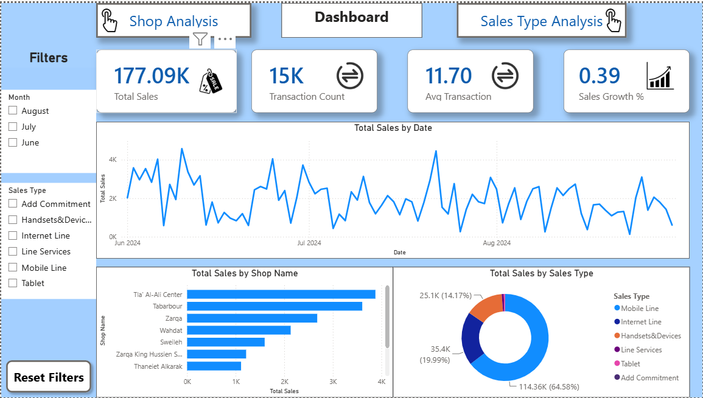
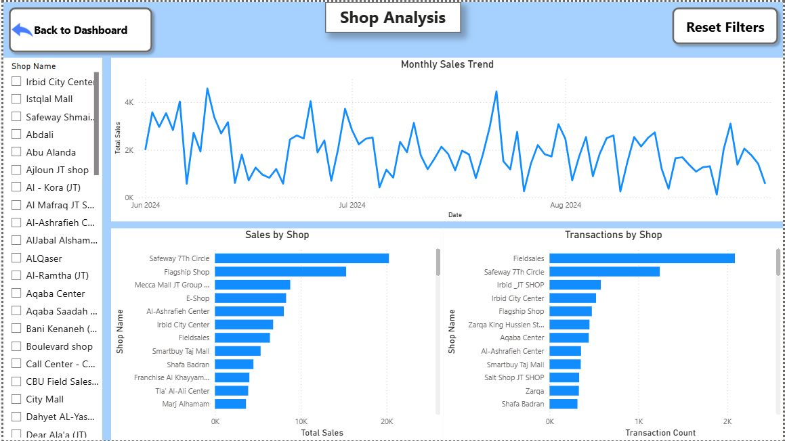
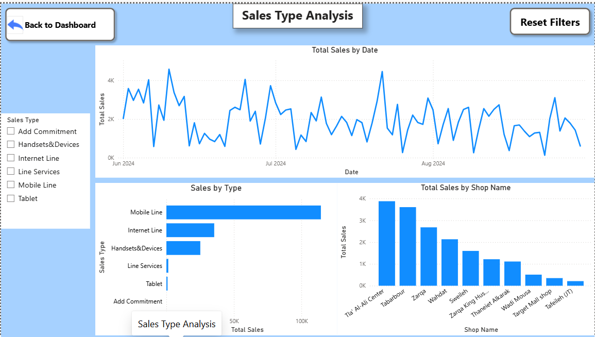

# 📊 Power BI Sales Dashboard

An interactive Power BI dashboard developed during the **Coderz Training Program** to analyze sales performance, monitor business KPIs, and provide actionable insights through dynamic visualizations.

---

# 📖 Project Overview

This project focuses on transforming raw data into meaningful business insights using Microsoft Power BI.

The dashboard was designed to help users monitor sales performance, identify top-performing shops, analyze different sales categories, and track business trends over time through an interactive and user-friendly interface.

The report consists of three main pages:

- Executive Dashboard
- Shop Analysis
- Sales Type Analysis

Each page provides different perspectives on the business while allowing users to interact with the data through filters and navigation buttons.

---

# 🖼️ Dashboard Preview

## Executive Dashboard

---

## Shop Analysis

---

## Sales Type Analysis

---

# ✨ Features

### Executive Dashboard

- Total Sales KPI
- Transaction Count KPI
- Average Transaction Value
- Sales Growth Percentage
- Monthly Sales Trend
- Sales by Shop
- Sales Distribution by Sales Type
- Interactive Filters
  - Month
  - Sales Type

### Shop Analysis

- Monthly Sales Trend
- Top Performing Shops
- Transactions by Shop
- Shop Filter
- Navigation Buttons
- Reset Filters Button

### Sales Type Analysis

- Sales Trend by Date
- Sales by Sales Type
- Shop Performance Comparison
- Sales Type Filter
- Navigation Buttons
- Reset Filters Button

### Interactive Features

- Cross-filtering between visuals
- Drill-down analysis
- Dynamic slicers
- Page navigation
- Clean and responsive dashboard layout

---

# 🛠️ Tools & Technologies

- Microsoft Power BI
- Power Query
- DAX (Data Analysis Expressions)
- Data Modeling
- Data Visualization
- Interactive Dashboard Design
- KPI Development

---

# 📈 Key Insights

The dashboard enables users to:

- Monitor overall sales performance through key performance indicators.
- Identify the highest-performing shops based on sales and transaction volume.
- Compare sales across different product and service categories.
- Analyze monthly sales trends to detect seasonal patterns.
- Measure average transaction value and business growth.
- Filter reports dynamically by month, shop, and sales type to support informed business decisions.

---

# 📂 Dataset

The dataset used in this project is **not publicly available** due to confidentiality restrictions.

To protect data privacy, the original dataset has not been included in this repository.

This project is shared to demonstrate my skills in:

- Data Cleaning
- Data Transformation
- Data Modeling
- DAX Calculations
- Business Intelligence
- Dashboard Design
- Interactive Reporting

---

# 🙏 Acknowledgements

This project was completed as part of the **Coderz Training Program**.

I would like to express my sincere gratitude to my mentor for the continuous guidance, valuable feedback, and support throughout the development of this project. Their mentorship played an important role in strengthening my Power BI and data analytics skills.

---

# 👨‍💻 Author

**Anas Marashdeh**

📧 Email: anas.marashdeh.16@gmail.com

🔗 LinkedIn:
www.linkedin.com/in/anasmarashdeh

💻 GitHub:
https://github.com/AnasMarashdeh

---

## ⭐ If you found this project interesting, feel free to give it a star!
